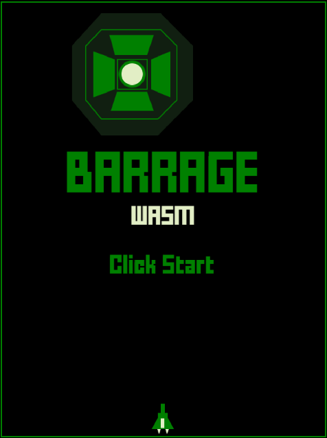

# BARRAGE 👾

Programming Shooting retoro mini game in Typescript & WebAssembly

[](https://myurioka.github.io/barragewasm/)

[Play in browser](https://myurioka.github.io/barragewasm)

### How to play (Control)

-   Mouse Operation : Ship Moving
-   Space key : Operates & Shooting
-   Special mode: If you don't shoot for a while

### Requirement

-   TypeScript, JavaScript
-   AssemblyScript

### How to Build & Run

```sh
$ cd barragewasm
$ npm run asbuild
$ npm start
```

Browse http://localhost:3000
